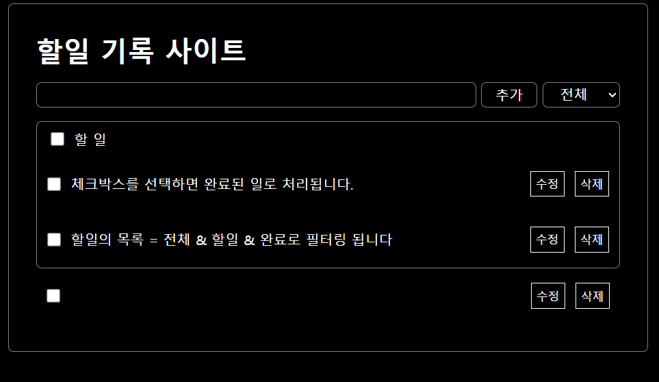

# REACT 할일 기록 사이트 만들기<br/>

```
    useReducer & useEffect & localstorage & context API를 활용한 할일 기록 사이트 입니다. 
```


## project setting <br/>
- `npm create vite@latest`<br/>
- REACT 버전 `^18.2.0`<br/>
- `npm install`<br/><br/>


## 할일의 추가 & 삭제 옵션  <br/>

- controls와 todoList와의 교류 APP.jsx에서 데이터 관리 <br/>
- 할일 -> 전체 선택 & 해제 기능<br/>
- App.js를 기반으로 cotrols.jsx와 TodoList -> Todoitem으로 움직임 <br/>
- 선택된 항목 삭제 (선택된 항목의 수 & 삭제기능)<br/><br/>


## 할일 수정 <br/>

- 각 리스트의 기록된 할일들을 수정하는 기능 <br/>
- 수정클릭시 input창으로 변하고 아이콘 변경기능<br/><br/>

## useEffect를 사용하요 데이터 보존 및 useReducer로 리팩토링 <br/>

- 추가 수정 삭제 토글의 옵션 <br/>
- 각각의 옵션들을 switch 문의 case로 상태관리 <br/>
- useState의 복잡한 로직 간편화 <br/>

## 데이터 저장<br/>

- useEffect로 localstorage를 사용<br/>
- JSON.stringfy 문자열로 저장 <br/>
- app.jsx에서는 useEffect로 저장의 역할 index.js는 저장된 파일을 불러오는 역할 <br/><br/>

## Context API 활용 <br/>

- 유지보수와 가독성 강화 <br/>

## CSS 다양한 방식 사용 <br/>

- Emotion 로 변경 <br/>
- Emotion 설치 `npm i @emotion/react@11.11.4 @emotion/styled@11.11.5`<br/>
- Tailwindcss로 변경 <br/>
- Tailwindcss설칭 `npm install -D tailwindcss@3.4.3 postcss autoprefixer`<br/>
- `npx tailwindcss init -p`<br/>
- `tailwindcss.com`에서 display 선택<br/><br/>

## Redux 적용 <br/>

- npm i @reduxjs/toolkit@2.2.3 react-redux<br/>
- slice를 활용해  Redux의 상태(state)와 관련된 `액션(action)과 리듀서(reducer)`를 더 쉽게 정의<br/>
- useSelector와 useDispatch를 활용한 상태관리  <br/>
- redux Thunk로 todo-List적용 <br/>
- `npm i json-server axios`설치<br/>


